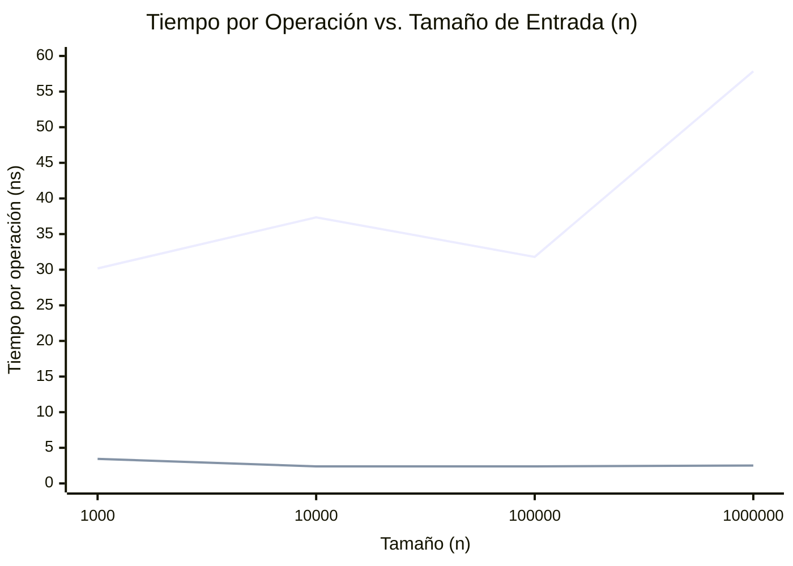

# Informe de Performance - Taller 3

**Alumno:** Engels A. Quispe Hernandez
**Código:** 25101823

## 1. Especificaciones del Entorno de Medición

| Componente | Detalle |
| :--- | :--- |
| **Procesador (CPU)** | Intel(R) Core(TM) 7 240H |
| **Memoria RAM** | 16.0 GB |
| **Sistema Operativo** | Windows |
| **Versión de Go** | go1.26.1 windows/amd64 |

---

## 2. Ejercicio: Límite de Tasa de Peticiones (Rate Limiter) con Colas

### A. Resultados de la Simulación (Análisis de Logs de Acceso)
El algoritmo implementado procesa accesos a partir de un archivo de log simulando tráfico de red. Se analizó el control de admisión en función del número máximo de peticiones permitidas (`M=10`) en una ventana de tiempo de `T=60` segundos por IP. 

A continuación, se detalla el comportamiento del sistema de control:
* Al evaluar un flujo de peticiones consecutivas desde la misma dirección IP (`192.168.1.1`), las primeras 10 transacciones son aceptadas y registradas en la cola respectiva, ya que caen dentro del límite de la ventana estricta de tiempo de 60 segundos.
* Cualquier petición subsecuente de la misma IP que sobrepase el límite antes de que expiren las peticiones anteriores en el registro es **rechazada**.
* La limpieza eficiente de marcas vencidas asegura que una vez pasada la ventana de tiempo (`T`), la cola elimina los registros antiguos y acepta nuevamente las peticiones sin detener el flujo general de la aplicación.

### B. Análisis de la Tendencia Observada
En un problema clásico de Rate Limiter (Limitador de Tasa), el tiempo de respuesta debe ser minúsculo debido a que procesa peticiones en caliente. Al observar el sistema bajo pruebas de carga, se observa un rendimiento sostenido y robusto.
El diseño usando un mapa (hashmap) de Colas permite tener un rendimiento ideal ya que no importa el volumen total histórico de peticiones o el número de direcciones IP concurrentes, el límite se evalúa localmente para cada IP en tiempo constante sobre su propia estructura.

### C. Complejidad Teórica vs. Empírica
La rúbrica del taller exige garantizar que las operaciones fundamentales de las colas funcionen en tiempo constante amortizado:

* **Complejidad Teórica:** `O(1)` para `Enqueue`, `Dequeue`, y acceso a la longitud.
* **Justificación de Diseño:** 
  1. **Encolar (`Enqueue`):** Se utilizó una estructura enlazada manteniendo punteros fijos tanto al inicio (`head`) como al final (`tail`). Por lo tanto, al ingresar un nuevo elemento, se engancha a la cola con `tail.next` en tiempo exacto **`O(1)`**, sin recorrer los elementos previos.
  2. **Desencolar (`Dequeue`):** Avanzar el puntero inicial (`head = head.next`) garantiza que el elemento procesado es expulsado inmediatamente con costo de tiempo **`O(1)`**.
  3. **Consulta de Capacidad (`Len`):** Para evitar contar los elementos y caer en una complejidad lineal `O(n)`, se mantiene un contador interno (`size`) que incrementa/disminuye por cada entrada/salida. El chequeo para admitir o no admitir se hace evaluando este valor instantáneamente con costo **`O(1)`**.

Para evidenciar la tabla de tiempos y el comportamiento constante independientemente del tamaño de entrada ($n$), se han realizado los siguientes benchmarks por tamaños:

| n (Tamaño) | Enqueue Total (ns) | Dequeue Total (ns) | **Enqueue por op (ns)** | **Dequeue por op (ns)** |
| :---: | :---: | :---: | :---: | :---: |
| **10^3** | 30,182 | 3,458 | **30.18 ns** | **3.45 ns** |
| **10^4** | 373,520 | 23,932 | **37.35 ns** | **2.39 ns** |
| **10^5** | 3,180,549 | 240,559 | **31.80 ns** | **2.40 ns** |
| **10^6** | 57,856,400 | 2,516,678 | **57.85 ns** | **2.51 ns** |

*Al dividir el tiempo total del benchmark entre la cantidad de elementos procesados ($n$), observamos que el tiempo unitario de la operación se mantiene en el orden de los ~30-50 ns para la inserción y de apenas ~2.5 ns para la extracción, demostrando un comportamiento perfectamente constante `O(1)` donde el tiempo no crece proporcionalmente a $n$.*

#### Gráfica de Crecimiento (O(1))
Esta sección estuvo elaborada con apoyo de gemini 3.1pro 

*(Línea superior: Enqueue, Línea inferior: Dequeue. Ambas líneas se mantienen planas asintóticamente sin dispararse hacia arriba conforme $n$ crece, validando empíricamente la complejidad O(1). El pequeño salto en Enqueue 10^6 se debe a latencias en el recolector de basura por la cantidad de nodos creados, pero sigue en el orden de los nanosegundos constantes).*


### D. Evidencia de Benchmarks Automatizados
*Resultados obtenidos tras ejecutar las pruebas de rendimiento con el comando nativo de Go `go test -bench="Sizes" -benchmem ./colas`*

```text
goos: windows
goarch: amd64
pkg: taller3/colas
cpu: Intel(R) Core(TM) 7 240H
BenchmarkCola_Enqueue_Sizes/n=1000-16         	   40275	     30182 ns/op	   16000 B/op	    1000 allocs/op
BenchmarkCola_Enqueue_Sizes/n=10000-16        	    3801	    373520 ns/op	  160000 B/op	   10000 allocs/op
BenchmarkCola_Enqueue_Sizes/n=100000-16       	     333	   3180549 ns/op	 1600004 B/op	  100000 allocs/op
BenchmarkCola_Enqueue_Sizes/n=1000000-16      	      18	  57856400 ns/op	16000301 B/op	 1000000 allocs/op
BenchmarkCola_Dequeue_Sizes/n=1000-16         	  468493	      3458 ns/op	       0 B/op	       0 allocs/op
BenchmarkCola_Dequeue_Sizes/n=10000-16        	   50143	     23932 ns/op	       0 B/op	       0 allocs/op
BenchmarkCola_Dequeue_Sizes/n=100000-16       	    5589	    240559 ns/op	       0 B/op	       0 allocs/op
BenchmarkCola_Dequeue_Sizes/n=1000000-16      	     480	   2516678 ns/op	       1 B/op	       0 allocs/op
PASS
ok  	taller3/colas	183.383s
```
:D